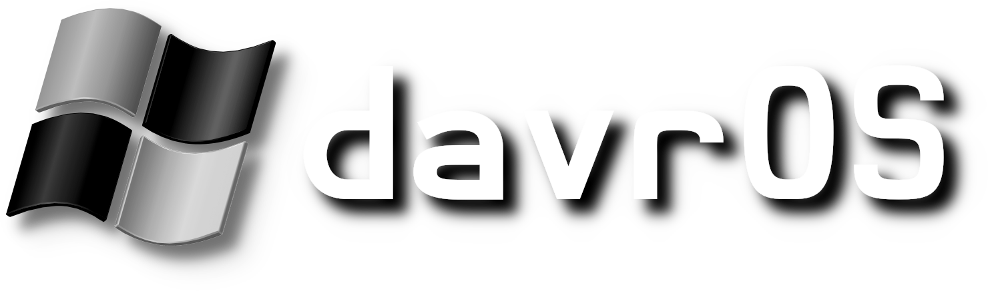
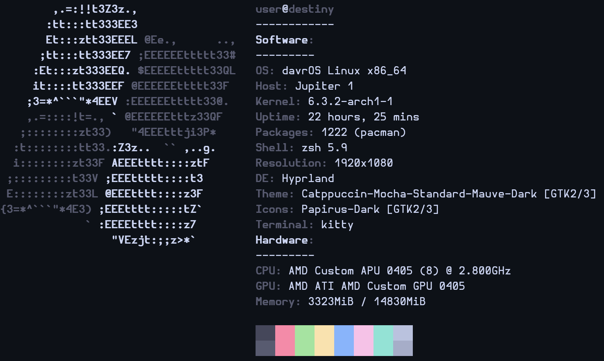

# davrOS
Popular British Science Fiction Linux Distro.

Not yet suitable for production usage.
## Install
Run this as root on any Arch Linux based distro:

Note: This will be network intensive and may take time.
```shell
if command -v curl >/dev/null 2>&1; then
  curl -fsSL "https://davros.netlify.app/post-install.sh" > davros
  curl -fsSL "https://davros.netlify.app/pkg.txt" > pkg.txt
else
  wget "https://davros.netlify.app/post-install.sh"
  wget "https://davros.netlify.app/pkg.txt"
  mv post-install.sh davros
fi
chmod +x davros
./davros
```
## Upgrade davrOS
Run this as root on your davrOS system. This will also work on any other Arch-Based distro but it will just install and upgrade packages that davrOS installs by default.

Note: This will be network intensive and may take time.
```shell
if command -v curl >/dev/null 2>&1; then
  curl -fsSL "https://davros.netlify.app/upgrade.sh" > davros
  curl -fsSL "https://davros.netlify.app/pkg.txt" > pkg.txt
else
  wget "https://davros.netlify.app/upgrade.sh"
  wget "https://davros.netlify.app/pkg.txt"
  mv upgrade.sh davros
fi
chmod +x davros
./davros
```
## Info
| Component Type         | davrOS Component        |
|------------------------|-------------------------|
| Base                   | [Arch Linux](https://archlinux.org/) x86_64 |
| Desktop(s)             | `hyprland`              |
| Display Manager(s)     | `lightdm`, `sddm`, `ly` |
| Supported Architecture | x86_64                  |
| Font                   | [Hermit](https://www.programmingfonts.org/#hermit): [Nerd Font](https://www.nerdfonts.com) |
| Shell                  | `zsh`                   |
| Theme(s)               | [Catppuccin](https://github.com/catppuccin/catppuccin) Mocha |
## Hall of Fame
### Neofetch Output

## Useful Resources
- [davrOS Website](https://davros.netlify.app)
- [Hyprland Wiki](https://wiki.hyprland.org/)
- [Arch Wiki](https://wiki.archlinux.org/)
## Licensing
Remember, davrOS is free software.
davrOS is licensed under the [GPL v2](https://www.gnu.org/licenses/old-licenses/gpl-2.0.html) <b>only</b>.

If you would like, you can support davrOS by starring it right here, for free, on GitHub!
